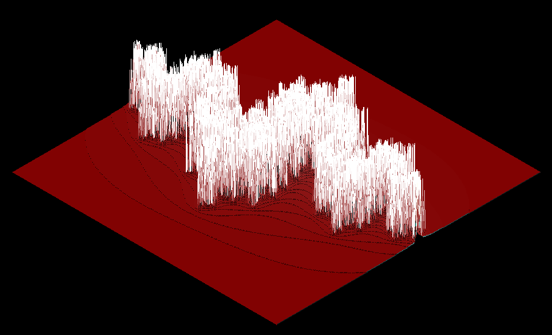

*This project has been created as part of the 42 curriculum by thtinner.*

# Description

FdF (Fil de Fer, meaning "wireframe" in French) is a 3D wireframe visualization project that renders height maps in isometric projection. The program reads a map file containing elevation data and displays it as a 3D wireframe model.

The project demonstrates fundamental graphics programming concepts including:
- 3D to 2D coordinate projection (isometric view)
- Bresenham's line drawing algorithm
- Real-time rendering and graphics optimization
- Event handling and user interaction

Built using the MLX42 graphics library (a modern version of MiniLibX).

## Demo


Example rendering of the Julia map in isometric projection.

# Instructions

## Compilation

1. Git clone and build MLX42:
```bash
git clone https://github.com/codam-coding-college/MLX42.git
cd MLX42
cmake -B build
cmake --build build
cd ..
```

2. Compile the project:
```bash
make
```

This will create the `fdf` executable and compile the custom `libft` library (which includes `ft_printf` and `get_next_line`).

## Usage

Run the program with a map file as argument:
```bash
./fdf maps/42.fdf
```

### Available Maps

The `maps/` directory contains several test maps:
- `42.fdf` - The classic 42 logo
- `pyramide.fdf` - A pyramid structure
- `mars.fdf` - Mars terrain data
- `julia.fdf` - Julia set fractal
- And more...

### Controls

- `ESC` - Exit the program
- Can also close the window with the mouse.

## Map File Format

Map files use a simple grid format where each number represents the height (z-value) at that position:
```
0  0  0  0  0
0 10 10 10  0
0 10 20 10  0
0 10 10 10  0
0  0  0  0  0
```

Optional color values can be specified in hexadecimal after a comma:
```
0,0xFF0000  0,0x00FF00  0,0x0000FF
```

# Resources

## General
- [Bresenham's Line Algorithm](https://en.wikipedia.org/wiki/Bresenham%27s_line_algorithm)
- [Isometric Projection and logic](https://42-cursus.gitbook.io/guide/2-rank-02/fdf)
- [MLX42 Documentation](https://github.com/codam-coding-college/MLX42) - Graphics library documentation

## AI Usage

The parsing was more or less completed without AI while the fundamental graphics algorithms, mathematical calculations (Bresenhamm and projection), and core rendering logic were implemented with the aid of AI (as well as the fundament of this README.)

## Project Structure

```
FdF/
├── fdf.c              # Main program entry point
├── fdf.h              # Main header file
├── fdf_utils.c        # Utility functions
├── mlx_launch.c       # MLX42 initialization
├── render.c           # Rendering pipeline
├── draw_utils.c       # Drawing utilities (line algorithm)
├── color_utils.c      # Color interpolation
├── hooks.c            # Event handlers
├── Makefile           # Build configuration
├── libft/             # Custom C library (includes ft_printf, get_next_line)
├── MLX42/             # Graphics library
└── maps/              # Test map files
`
